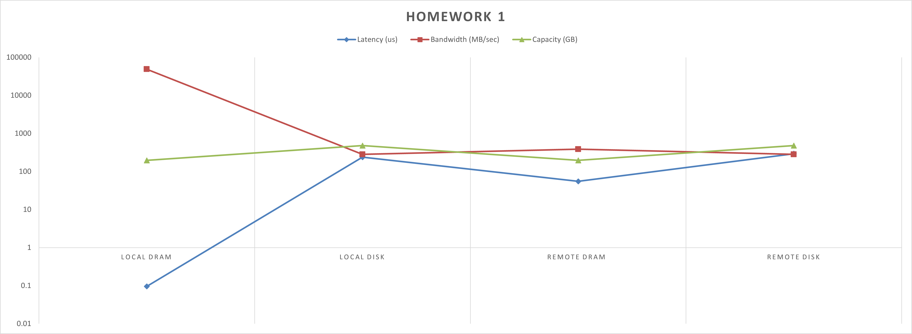

# Homework 1

In this assignment, I used a two-node (c220g5) cluster within the University of Wisconsin's CloudLab. I measured latency, bandwidth, and capacity to understand the performance characteristics of this setup.

## Graph

## Comments
**Latency:** Measured in microseconds (us), the graph shows that local DRAM has the lowest latency (0.096), indicating that it is the fastest in terms of access time. This is expected as DRAM is typically much faster than disk storage. The latency increases for local disk (238.6) and further increases for remote DRAM (55.096) and remote disk (293.6), because of added network latency (55 us).

**Bandwidth:** Measured in Megabytes per second (MB/sec), the bandwidth is highest for local DRAM (48662.9), which aligns with its low latency characteristic, supporting very fast data transfer rates. The bandwidth drops significantly for local disk (282), which is typical. Upon evaluating the network bandwidth, it registered at 386.25 MB/s, showing that the remote DRAM could use the full capacity of the network at 386.25 MB/s. In the case of the remote disk bandwidth, it was the local disk bandwidth that acted as a bottleneck, leading to a maximum bandwidth of 282 MB/s for the remote disk, matching that of the local disk

**Capacity:** Measured in Gigabytes (GB), the graph indicates that local and remote disk have substantially higher capacity (480) compared to DRAM (197), which is also typical in computing systems where disk storage provides larger capacity for data.

## Conclusion
In conclusion, the graph demonstrates that local DRAM is the quickest for data processing. Local disks, although slower, hold significantly more data. Also, the local disk's limited speed also limited the remote disk's performance, preventing it from reaching the higher speeds that the network could support. In contrast, the remote DRAM effectively used the full speed of the network, showing its advantage over disk storage.
